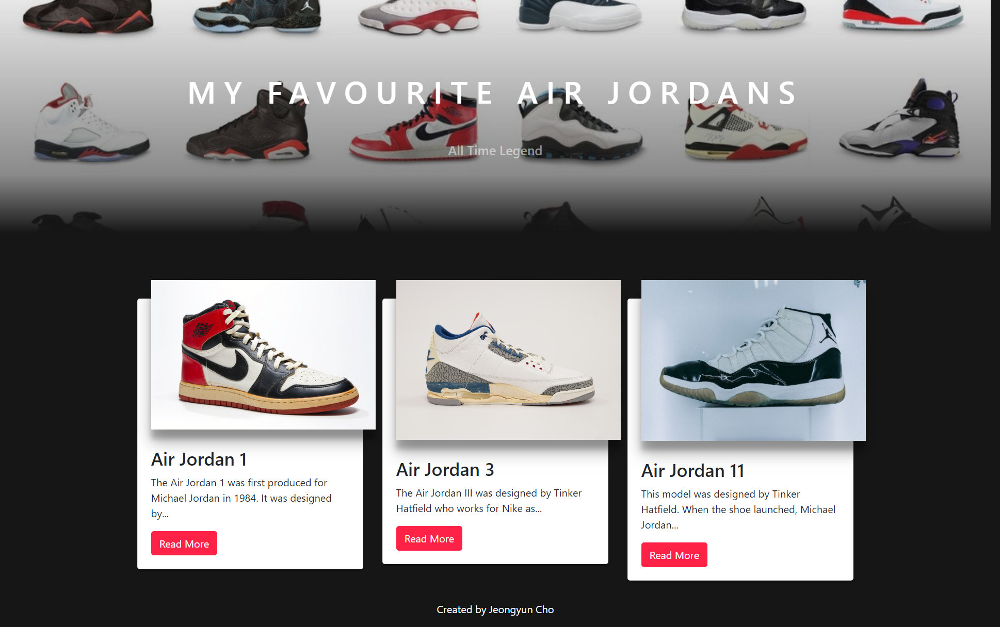

# Cho_J_FaveThings

This project is built to show my favourite thing in three options so I chose air jordans and show a brief history about my 3 favourite air joradan numberings.

Used Node.js to express route.
data by phpmyadmin. mysql

## Get Started

npm start on cmd to start the app.

## Built with:

- Adobe Photoshop
- phpmyadmin
- SASS
- https://expressjs.com/
- https://handlebarsjs.com/
- mySql
- Node.js
